## 3020_ASSIGNMENT_2 TESTING DOCUMENT
### TEAM MEMBERS:
LUKA NIKOLAISVILI

FARZAD IMRAN 

FREDERICK NKWONTA

# TEST CASES:

 #### list all here
 ## Insert testing
- case 1 Insert empty word at some index
  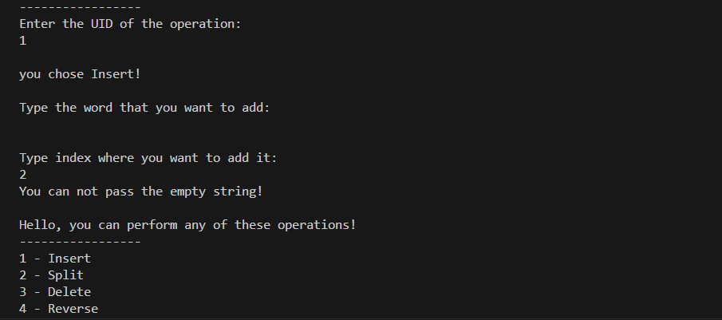
- case 2 Insert some word on negative index
  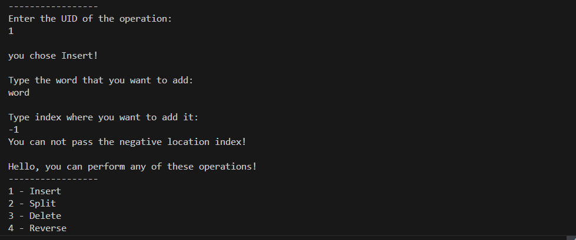
- case 3 insert word on positive index
  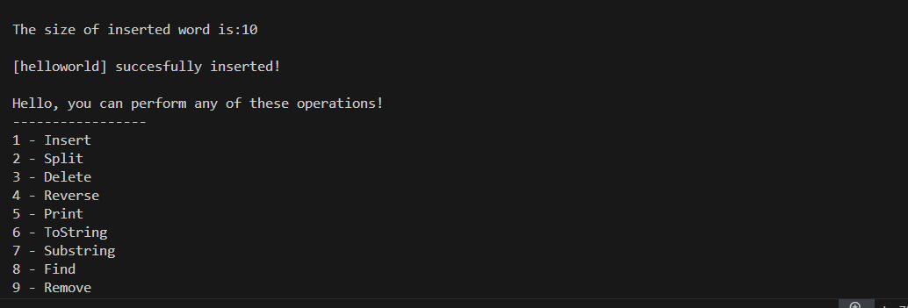
## Reverse Testing
- case 10 reverse string 
  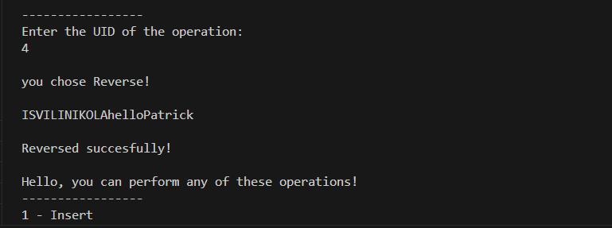 
- case 11 reverse same string back to original
  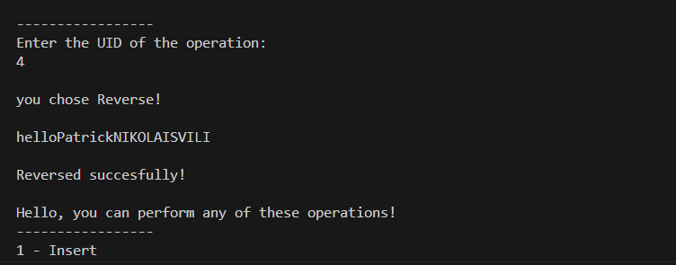 
## Print Testing
- case 13 print 1st time at the initialization
  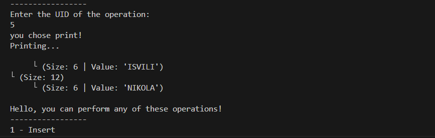 
- case 14 print second time after inserting word helloPatrick at index 4
  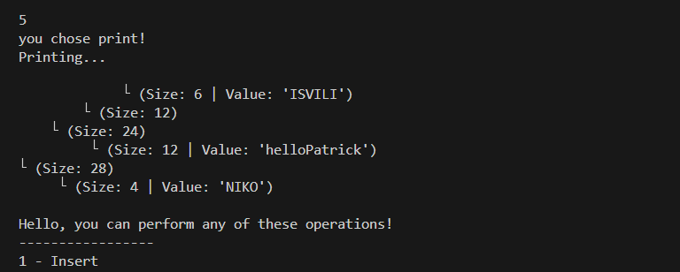
## ToString Testing
- case 16 test toString first time at the initialization
  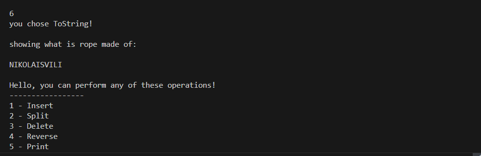
- case 17 test toString after adding helloPatrick at index 2
  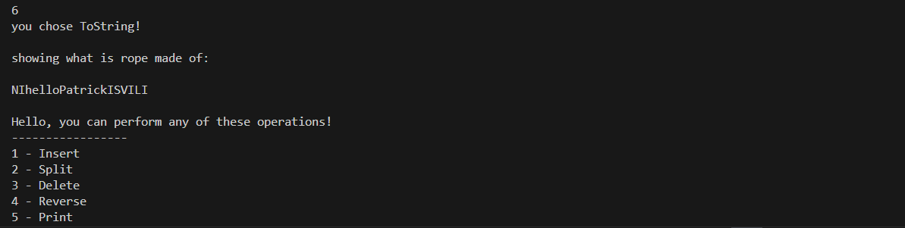
- case 18 test tostring after adding HelloMarker at index 4
  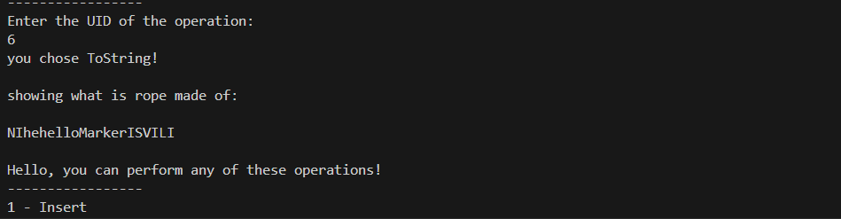
## Substring Testing
- case 19 at the initialization on the string NIKOLAISVILI find substring 0,5 NIKOLA
  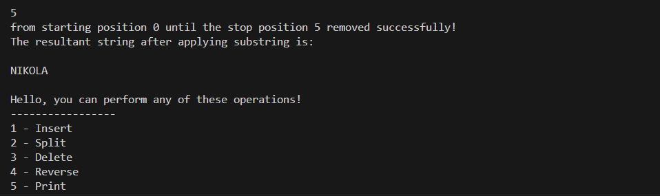 
- case 20 add word hello at the index 1 and find 0,5 substring 
  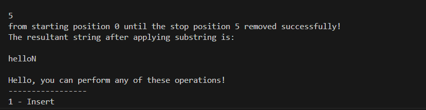
- case 21 find substring from 0 to -1 (cant do that!)
  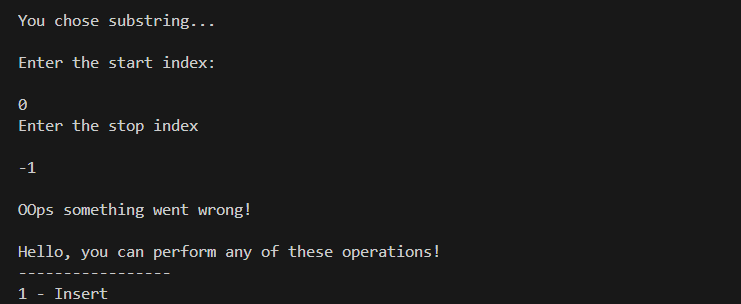 
## Find Testing
- case 22 at the initialization find the string NIKO should find at index 0!
  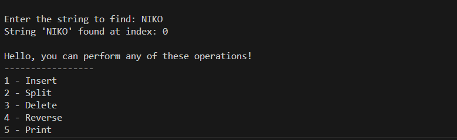
- case 23 add patrick at the index 0 and find RICK index 3 
  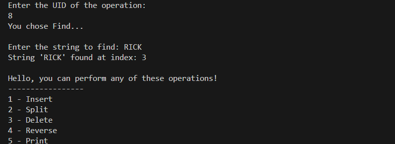
- case 24 find KTPA should not find there is no string like that 
  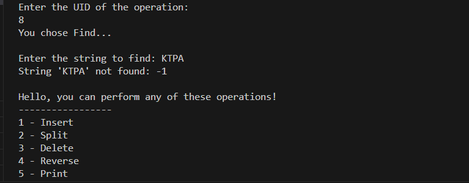
## Delete Testing
- case 25 
  
- case 26
  
- case 27
  
## CharAt Testing
- case 28 at the initialization find the character 0 
  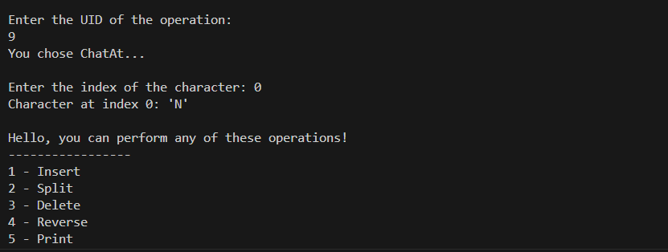
- case 29 add patrick at index 5 and find char at 10 should be C
  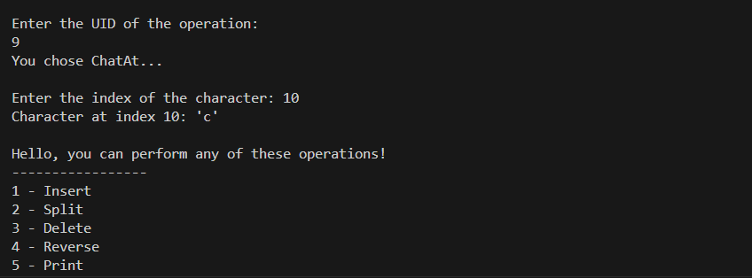
- case 30 find character at -1 
  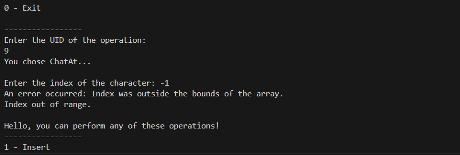
## IndexOf Testing
- case 31 at the initialization find the index of N 0 should be returned
  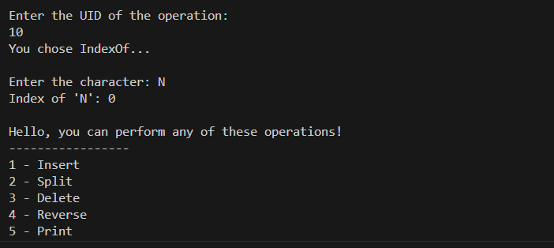
- case 32 add word Farzad at the index 6 and find index of F
  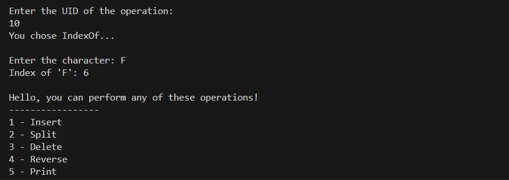
- case 33 look for some character that is not in there for example J
  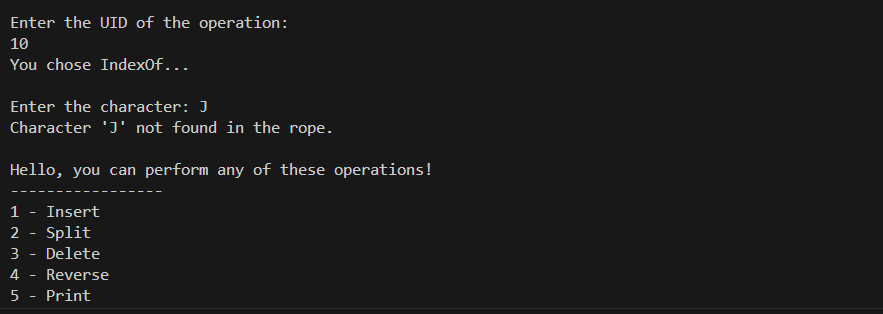 
## Rebalance Testing
- case 37
  
- case 38
  
- case 39
  
## Concatenate Testing
- case 40 Concatenate LUKA WITH NIKOLAISVILI we should get LUKANIKOLAISVILI 
  
- case 41 Concatenate FreddyFarzad to this word
  
- case 42
  
## Split Testing
- case 43
  
- case 44
  
- case 45
  
